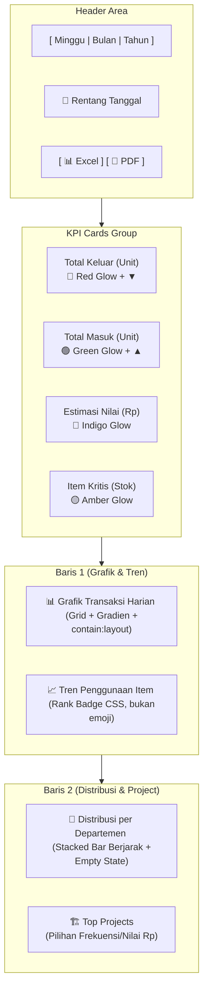

# Usulan Redesign Menu Laporan (Report Page) — v2

Revisi dari draft awal. Perubahan: rank badge dipastikan sebagai elemen CSS (bukan emoji), tambahan catatan aksesibilitas warna, dan klarifikasi definisi "periode sebelumnya".

---

## 1. Desain Ulang Header & Filter Periode
* **Segmented Pill Control**: bar terpadu bergaya *segmented control* untuk "Minggu / Bulan / Tahun", transisi slide halus antar pilihan.
* **Date Range Badge**: info rentang tanggal dibungkus badge dengan ikon kalender (SVG, bukan emoji — konsisten di semua platform/browser).

## 2. KPI Cards yang Lebih Premium & Glow
* **Subtle Radial Glow**: efek pancar cahaya tipis di latar kartu sesuai warna indikator (merah/hijau/indigo/amber).
* **Efek Hover**: animasi *lift-up* + bayangan lebih tebal saat hover.
* **Trend Indicator**: perbandingan otomatis di bawah nilai utama (`+5% dibanding minggu lalu`).
  * **Definisi periode pembanding** (agar tidak ambigu saat implementasi):
    * Minggu → 7 hari terakhir vs 7 hari sebelumnya (rolling, bukan minggu ISO).
    * Bulan → bulan kalender berjalan vs bulan kalender sebelumnya.
    * Tahun → tahun kalender berjalan vs tahun sebelumnya.
  * Jika data pembanding tidak ada (`prev = 0`), tampilkan indikator "Baru" — jangan tampilkan `Infinity%` atau `NaN%`.

## 3. Bar Chart Transaksi yang Lebih Modern
* **Gradient Bars & Rounded Corners**: gradien warna per kategori (Keluar: merah→orange, Masuk: hijau→mint), sudut atas membulat.
* **Horizontal Grid Lines**: garis grid samar (opasitas 5%) di latar grafik.
* **Hover Interaction**: bar aktif membesar sedikit, bar lain memudar — dibatasi lewat `contain: layout paint` agar tidak memicu repaint berat saat dataset besar (mis. transaksi harian sebulan penuh).

## 4. Tren Penggunaan & Top Items dengan Rank Badge
* **Rank Badges — elemen CSS, bukan emoji**: badge `#1/#2/#3` dirender sebagai `` dengan gradient warna logam (Emas, Perak, Perunggu) yang didefinisikan di CSS. Peringkat ≥4 pakai badge abu-abu netral.
  > Catatan: draft awal menyebut emoji (🥇🥈🥉) di rencana implementasi teknis, yang bertentangan dengan gradient CSS yang diusulkan di sini — emoji dirender font sistem OS dan tidak bisa diberi gradient CSS. Versi ini mengunci pendekatan CSS sebagai satu-satunya sumber kebenaran visual.
* **Desain Progress Bar Baru**: bar sejajar, opasitas rendah untuk periode sebelumnya, opasitas penuh untuk periode berjalan.
* **Indikator Lonjakan (Spike)**: badge ⚡ Lonjakan bergaya tag modern merah menyala.

## 5. Visualisasi Departemen & Project
* **Horizontal Stacked Bar**: pemisah tipis antar kategori.
* **Project Progress**: gradien oranye-emas (unit) dan violet-biru (nilai Rp), efek *glassy shine*.
* **Empty state**: departemen/project tanpa transaksi pada periode terpilih menampilkan pesan kosong yang jelas — bukan bar/glow kosong tanpa keterangan.

## 6. Aksesibilitas (baru)
* Karena Keluar/Masuk dibedakan lewat merah/hijau, tambahkan ikon arah (▲/▼) di samping nilai agar tetap terbaca oleh user dengan color vision deficiency (red-green, tipe paling umum).

---

## Visual Layout Mockup (Struktur Dua Kolom)

---

> [!NOTE]
> Semua usulan desain di atas diimplementasikan murni menggunakan **Vanilla CSS** agar performa tetap maksimal dan layout responsive di semua resolusi layar (Mobile & Desktop). Rank badge dan ikon kalender dipastikan berbasis CSS/SVG, bukan emoji, agar tampilan konsisten lintas browser dan platform.
